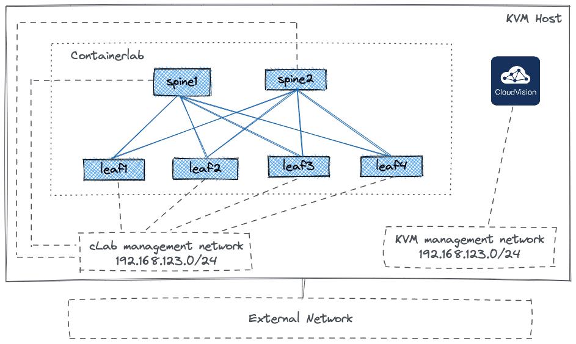
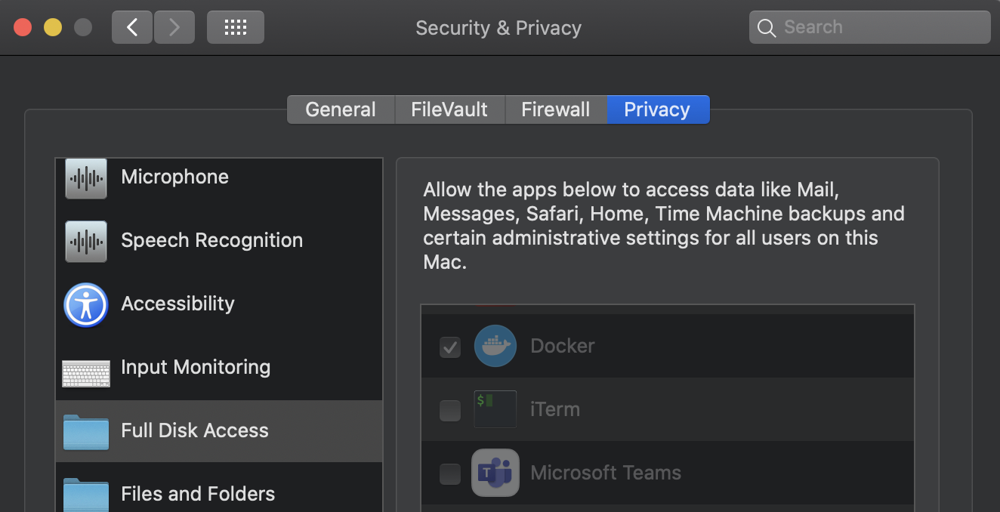
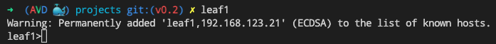

# AVD Quickstart Containerlab

> **WARNING**  
> Please read the guide before you start using AVD Quickstart Containerlab.
> Make sure that you understand the consequences of running Containerlab, cEOS-lab and various scripts provided with this repository on your machine. The components of the lab may change your system settings as they will have super user privileges.
> While this repository was tested on a number of machines without doing any harm, have a plan B. You are responsible for your lab machine, not the contributors.
>
> `"With su power comes great responsibility" (c)`
>
> ```text
>   /  _  \
> \_\_(_)_/_/
>  _/ /o\ \_
>    /   \
> ```

**For M1 MacBooks owners**:  
> Sorry. Not yet supported.

- [AVD Quickstart Containerlab](#avd-quickstart-containerlab)
  - [Overview](#overview)
  - [Lab Requirements](#lab-requirements)
  - [MacOS Limitations and Required Settings](#macos-limitations-and-required-settings)
  - [Release Notes](#release-notes)
  - [How To Use The Lab](#how-to-use-the-lab)
  - [How To Destroy The Lab](#how-to-destroy-the-lab)
  - [Containerlab Scalability with cEOS](#containerlab-scalability-with-ceos)

## Overview

The AVD Quickstart repository is a collection of Arista EOS labs based on [Containerlab](https://containerlab.srlinux.dev/) that you can build on any machine with Docker in a few minutes.
The ultimate target of this repository is to provide a **portable Arista lab collection** for everyone. This collection can be used to learn and test certain Arista EOS features and in certain cases even build configs for production environment with the excemption of hardware features.

Some labs provided in this repository can be used with CloudVision Portal VM that must be deployed separately. But all labs that are not focused on CVP features can be used without such VM as it is quite resource intensive and can not be deployed on an avarage laptop for example.

> **WARNING**: if CVP VM is part of the lab, make sure that it's reachable and credentials configured on CVP are matching the lab.

The initial lab list provided in this repository is focused on learning and testing [AVD](https://avd.sh/en/latest/).
Some labs can be easily adjusted to your needs using simplified CSV and YAML inputs.

Currently following labs are available:

- AVD repository to build EVPN MLAG network
- AVD repository to build EVPN Active-Active network

## Lab Requirements

A machine with Docker CE or Docker Desktop is required.
Following operating systems were tested:

- Ubuntu LTS Server
- MacOs (on x86 laptops only)
The lab is expected to run on any major Linux distribution.
Please test and contribute by reporting and/or fixing possible issues.

Hardware requirements depend on the number of containers deployed. Please read [Containerlab Scalability with cEOS](#containerlab-scalability-with-ceos) section before deploying a large topology.
For a small topology of 10+ cEOS containers 8 vCPUs and 10 GB RAM are recommended.

> **WARNING**: Please make sure that your host has enough resorces. Otherwise Containerlab can enter "frozen" state and require Docker restart.

To install Docker on a Linux machine, check [this guide](https://docs.docker.com/engine/install/ubuntu/).
To get Docker Desktop, check [docker.com](https://www.docker.com/products/docker-desktop/).

If you are planning to deploy Containerlab on a dedicated Linux host, you can also install and configure KVM and deploy CloudVision Portal as a virtual machine. To install KVM, check [this guide](https://github.com/arista-netdevops-community/kvm-lab-for-network-engineers) or any other resource available on internet. Once KVM is installed, you can use one of the following repositories to install CVP:

- ISO-based KVM installer - currently not available on Github and distributed under NDA only. That will be fixed later.
- [CVP KVM deployer](https://github.com/arista-netdevops-community/cvp-kvm-deployer)
- [CVP Ansible provisioning](https://github.com/arista-netdevops-community/cvp-ansible-provisioning)

It is also possible to run CVP on a dedicated host and a different hypervisor as long as it can be reached by cLab devices.

> NOTE: to use CVP VM with container lab it's not required to recompile Linux core. That's only required if you plan to use vEOS on KVM for you lab setup.

The lab setup diagram:



## MacOS Limitations and Required Settings

> The AVD Quickstart lab is not supported on M1 MacBooks right now.

Prerequisites to stat AVD Quickstart on MacOS:

1. It is recommended to use cEOS-lab 4.28.0F or higher. Earlier cEOS-lab versions require cgroup v1 support. But default, latest Docker Desktop only supports cgroup v2. To enable cgroup v1 support in Docker Desktop, you can uncomment corresponding line in `MacOS_set_DockerDesktop.sh` script before executing it with `make prepare_macos` command.
2. Docker Desktop must have access to a number directories to run AVD Quickstart environment. Some locations do not even exist on MacOS, but can exist inside the container. That means, they must be present in Docker Desktop settings, but it's not possible to add them via GUI. `make prepare_macos` will add these directories to Docker Desktop `settings.json` and install required tools with `brew`. This tool requires [Homebrew](https://brew.sh/) to be installed first.
3. Allow full disk access fo Docker Desktop in `System Preferences` > `Security & Privacy`. You can limit that to specific directories, but full disk access is preferred for simplicity.



> `make prepare_macos` script is based on the code mentioned in this [Docker Desktop for Mac issue on Github](https://github.com/docker/for-mac/issues/6073). With some modifications to allow access to certain directories and install missing tools.

## Release Notes

- **0.1**
  - initial release with many shortcuts
- **0.2**
  - Fix bugs.
  - Improve lab topology.
  - Improve lab workflow.
  - Add EVPN AA scenario.
- **0.3**
  - The lab now only requires Docker. Containerlab installation is not required and will be running inside provided Docker container.
  - When building container with `make build`, UID and GID will be updated using intermediate container similar to the container used by VSCode devcontainers.
  - The Dockerfile can be used as VSCode devcontainer or standalone.
  - The lab environment is now supported and tested on MacOS. x86 MacBooks only.
  - Dynamic aliases in the container for quick access to lab devices.

## How To Use The Lab

This section is explaining basic AVD quickstart lab workflow.

1. Clone AVD quickstart repository to your lab host: `git clone https://github.com/arista-netdevops-community/avd-quickstart-containerlab.git` Or use your favorite IDE (like VSCode) for that.
2. It is recommended to remove git remote as changes are not supposed to be pushed to the origin: `git remote remove origin`
3. Change to the lab directory: `cd avd-quickstart-containerlab`. IDE should do that for you automatically.
4. Before running the lab it is recommended to create a dedicated git branch for you lab experiments to keep original branch clean.
5. Check makefile help for the list of commands available: `make help`

```zsh
petr@nuc10i7:~/avd-quickstart-containerlab$ make help
avd_build_cvp                  build configs and configure switches via eAPI
avd_build_eapi                 build configs and configure switches via eAPI
avd_snapshot                   build configs and configure switches via eAPI
avd_validate                   build configs and configure switches via eAPI
build                          Build docker image
clab_deploy                    Deploy ceos lab
clab_destroy                   Destroy ceos lab
clab_graph                     Build lab graph
clean                          Remove all containerlab files and directories
help                           Display help message
inventory_evpn_aa              onboard devices to CVP
inventory_evpn_mlag            onboard devices to CVP
onboard                        onboard devices to CVP
prepare_mac_os                 Prepare Docker Desktop on MacOS for cEOS-based Containerlab
rm                             Remove all containerlab files and directories
run                            run docker image, if the image is not present - build it first
```

6. If cEOS image does not exist on your host yet, download it from [arista.com](https://www.arista.com/) and import. For example: `docker import <path-to-you-download-location>/ cEOS-lab-4.27.0F.tar ceos-lab:4.27.0F`. The image tag must match the parameters defined in the lab files, for example `CSVs_EVPN_AA/clab.yml` or `CSVs_EVPN_MLAG/clab.yml`.
7. Use `make build` to build `avd-quickstart:latest` container image. If that was done earlier and the image already exists, you can skip this step. If you are using VSCode devcontainer, VSCode will do that for you automatically.
8. (Optional) If VSCode devcontainer is used, the container will start automatically. Otherwise you can start it manually in the interactive mode by entering `make run`. You can also skip this steps and execute all commands listed below directly on your host. They will run inside a non-interactive container in that case.
9. Build lab inventory with `make inventory_evpn_aa` (EVPN Active-Active scenario) or `make inventory_evpn_mlag` (EVPN MLAG scenario). This will create a directory with all files required to build the lab.
10. Review the inventory generated by AVD quickstart. Optional: you can git commit the changes.
11. Run `make clab_deploy` to build the containerlab. Wait until the deployment will finish.
12. If you are working with `avd-quickstart:latest` container in the interactive mode, you can add aliases to connect to the lab devices quickly: `add_aliases`. This will allow you to connect to any lab device by typing it's short hostname. For example, `leaf1` will SSH to the switch with the corresponding hostname. You can list generated aliases with `alias` command. This can be especially useful on MacOS, as `/etc/hosts` file can not be changed by Containerlab due to system integrity check restrictions.



13. If CVP VM is used in the lab, onboard cLab switches with `make onboard`. Once the script behind this shortcut wil finish, devices will appear in the CVP inventory.
14. To build EVPN configuration and deploy it on the lab switches, you can execute corresponding Ansible AVD playbook with `make avd_build_eapi` (deploy directly) or `make avd_build_cvp` (deploy via CVP if it's present in the lab) shortcut. That will execute `playbook/fabric-deploy-eapi.yml` or `playbook/fabric-deploy-cvp.yml` playbooks. If the configuration is delivered via CVP, don't forget to execute the tasks generated by the playbook.
15. Once the configs are deployed, you can SSH to any switch using corresponding alias and type any show commands to check the lab state. Verify that hosts can ping each other.
16. To test Ansible AVD post-validation role, use `make avd_validate`. The playbook itself is located at `playbooks/validate-states.yml`. This will generate corresponding reports in the lab directory.
17. You can also collect as snapshot (series of pre-defined show commands) with `make avd_snapshot`.
18. You can optionally git commit the changes and start playing with the lab. Use CSVs to add some VLANs, etc. for example. Re-generate the inventory and check how the AVD repository data changes.

## How To Destroy The Lab

1. Execute `make clab_destroy` to destroy the containerlab.
2. Execute `make rm` or `make clean` to delete the generated AVD inventory.

## Containerlab Scalability with cEOS

> under construction, coming soon
