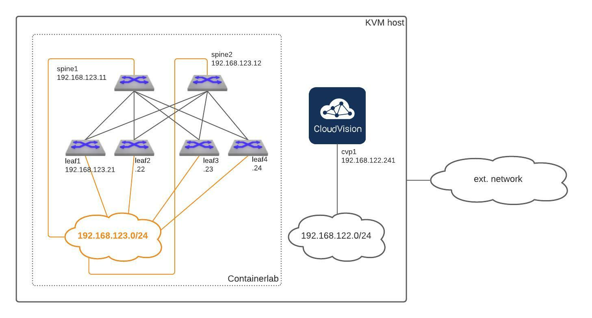

# AVD Quickstart Containerlab

> **WARNING**
> This repository is still under construction. It's fully functional, but has number of limitations.
> For example:
> - README is still work-in-progress
> - Lab configuration and adresses are hardcoded and have to be redefined in many different files if you setup is different. That will be simplified before the final release.
> - Some workflow and code optimization required.

- [AVD Quickstart Containerlab](#avd-quickstart-containerlab)
- [Overview](#overview)
  - [Release Notes:](#release-notes)
  - [Lab Prerequisites](#lab-prerequisites)
  - [How To Use The Lab](#how-to-use-the-lab)
  - [How To Destroy The Lab](#how-to-destroy-the-lab)

# Overview

This repository helps to build your own [AVD](https://avd.sh/en/latest/) test lab based on [Containerlab](https://containerlab.srlinux.dev/) in minutes.
The main target is to provide an easy way to build the environment to learn and test AVD automation.
The lab can be used together with CVP VM, but it's not mandatory.

> WARNING: if CVP VM is part of the lab, make sure that it's reachable and credentials configured on CVP are matching the lab.

## Release Notes:

- **0.1**
  - initial release with many shortcuts
- **0.2**
  - Fix bugs.
  - Improve lab topology.
  - Improve lab workflow.
  - Add EVPN AA scenario.

## Lab Prerequisites

The lab requires a single Linux host (Ubuntu server recommended) with [Docker](https://docs.docker.com/engine/install/ubuntu/) and [Containerlab](https://containerlab.srlinux.dev/install/) installed.
It's possible to run [Containerlab on MacOS](https://containerlab.srlinux.dev/install/#mac-os), but that was not tested. Dedicated Linux machine is currently the preferred option.

To test AVD with CVP, KVM can be installed on the same host. To install KVM, check [this guide](https://github.com/arista-netdevops-community/kvm-lab-for-network-engineers) or any other resource available on internet. Once KVM is installed, you can use one of the following repositories to install CVP:
- ISO-based KVM installer - currently not available on Github and distributed under NDA only. That will be fixed later.
- [CVP KVM deployer](https://github.com/arista-netdevops-community/cvp-kvm-deployer)
- [CVP Ansible provisioning](https://github.com/arista-netdevops-community/cvp-ansible-provisioning)

It is definitely possible to run CVP on a dedicated host and a different hypervisor as long as it can be reached by cLab devices.

> NOTE: to use CVP VM with container lab it's not required to recompile Linux core. That's only required if you plan to use vEOS on KVM for you lab setup.

The lab setup diagram:



## How To Use The Lab

1. Clone this repository to your lab host: `git clone https://github.com/arista-netdevops-community/avd-quickstart-containerlab.git`
2. It is recommended to remove git remote as changes are not supposed to be pushed to the origin: `git remote remove origin`
3. Change to the lab directory: `cd avd-quickstart-containerlab`
4. Before running the lab it is recommended to create a dedicated git branch for you lab experiments to keep original branch clean.
5. Check makefile help for the list of commands available: `make help`

```zsh
petr@nuc10i7:~/avd-quickstart-containerlab$ make help
avd_build_cvp                  build configs and configure switches via eAPI
avd_build_eapi                 build configs and configure switches via eAPI
build                          Build docker image
clab_deploy                    Deploy ceos lab
clab_destroy                   Destroy ceos lab
clab_graph                     Build lab graph
help                           Display help message
inventory_evpn_aa              onboard devices to CVP
inventory_evpn_mlag            onboard devices to CVP
onboard                        onboard devices to CVP
rm                             Remove all containerlab directories
run                            run docker image. This requires cLab "custom_mgmt" to be present
```

4. If you don't have cEOS image on your host yet, download it from arista.com and import. Make sure that image name is matching the parameters defined in `CSVs_EVPN_AA/clab.yml` or `CSVs_EVPN_MLAG/clab.yml`
5. Use `make build` to build `avd-quickstart:latest` container image. If that was done earlier and the image already exists, you can skip this step.
6. Run `make inventory_evpn_aa` or `make inventory_evpn_mlag` to build the inventory for EVPN AA or MLAG scenario. Ideally AVD inventroy must be a different repository, but for simplicity script will generate inventory in the current directory.
7. Review the inventory generated by avd-quickstart. You can optionally git commit the changes.
8. Run `make clab_deploy` to build the containerlab. Wait until the deployment will finish.
9. Execute `make run` to run `avd-quickstart` container.
10. If CVP VM is used in the lab, onboard cLab switches with `make onboard`. Once the script behind this shortcut wil finish, devices will appear in the CVP inventory.
11. To execute Ansible AVD playbook, use `make avd_build_eapi` or `make avd_build_cvp` shortcuts. That will execute `playbook/fabric-deploy-eapi.yml` or `playbook/fabric-deploy-cvp.yml`.
12. Run `make avd_validate` to execute AVD state validation playbook `playbooks/validate-states.yml`.
13. Run `make avd_snapshot` if you want to collect a network snapshot with `playbooks/snapshot.yml`.
14. Connect to hosts and switches and run some pings, show commands, etc. To connect to a lab device, you can type it's hostname in the container:


> NOTE: device hostnames are currently hardcoded inside the `avd-quickstart` container. If you have customized the inventory, ssh to the device manually. That will be improved in the coming versions.

You can optionally git commit the changes and start playing with the lab. Use CSVs to add some VLANs, etc. for example. Re-generate the inventory and check how the AVD repository data changes.

## How To Destroy The Lab

1. Exit the `avd-quickstart` container by typing `exit`
2. Execute `make clab_destroy` to destroy the containerlab.
3. Execute `make rm` to delete the generated AVD inventory.
